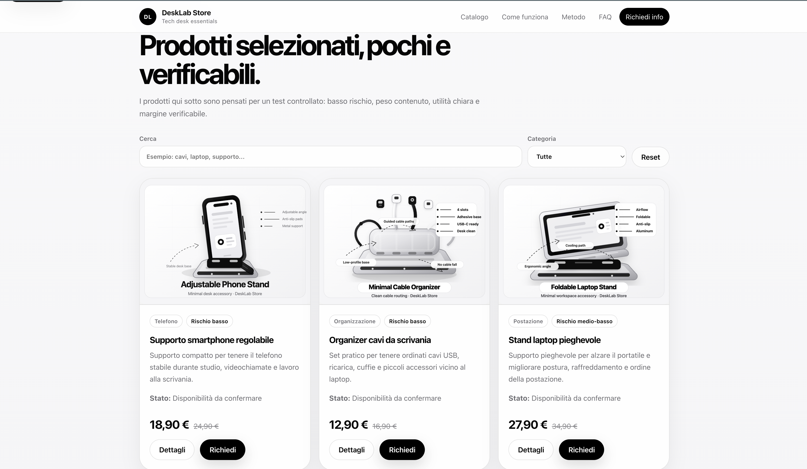
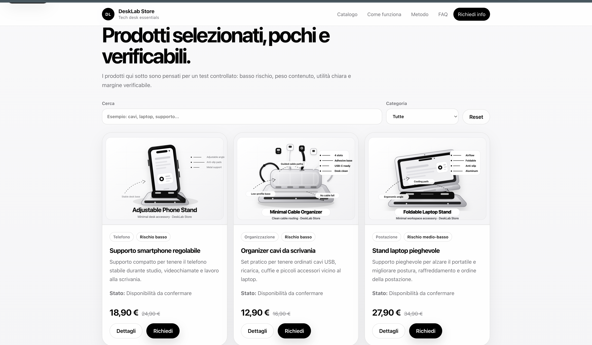

# DeskLab Store — v0.3 Premium Motion

DeskLab Store is a static e-commerce validation project for desk setup, study, productivity and lightweight tech accessories. The purpose of the project is not to behave like a finished commercial shop with automated checkout, warehouse management and payment processing. Its purpose is to validate a focused product catalogue with a clean public interface, a controlled manual ordering workflow, transparent availability checks and a realistic path from prototype store to a more mature online business.

The current version is **v0.3 Premium Motion**. Compared with the first static MVP, this version includes a more polished visual layer, motion enhancements, a structured product catalogue based on JSON, legal draft pages, margin and supplier support files, GitHub Pages publication and a clearer documentation baseline for portfolio review.

Live site:

https://antonmorosi06.github.io/desklab-store/

Repository:

https://github.com/AntonMorosi06/desklab-store

## Project status

DeskLab Store is currently a **static validation storefront**. It is suitable for portfolio presentation, UI experimentation, catalogue validation and early business planning. It is not yet a fully operational e-commerce platform.

Current status:

- Version: v0.3 Premium Motion
- Hosting: GitHub Pages
- Frontend: static HTML, CSS and JavaScript
- Product data: local JSON catalogue
- Backend: not included
- Database: not included
- Automated checkout: not included
- Payment processing: not included
- Order management: manual / planned
- Legal documents: draft notes only, not final legal advice
- Commercial readiness: validation stage, not production-scale retail

This distinction is important. The project is intentionally honest: it shows what already works, what is mocked or manual, and what still needs validation before real commercial use.

## What the site does

DeskLab Store presents a small catalogue of desk and productivity accessories. Products are loaded from `products.json`, displayed in a clean storefront interface and enriched with categories, descriptions, supplier cost targets, margin goals, risk levels and availability notes.

The site is designed around a cautious manual-commerce workflow:

1. The visitor explores the product catalogue.
2. The visitor requests information or availability.
3. The seller checks supplier availability, delivery time, real cost and margin.
4. The seller confirms the final conditions manually.
5. A payment link may be sent only after verification.
6. The order is handled according to verified shipping and return conditions.

This avoids pretending that the store already has a complete automated checkout or stock system.

## Core features

The current version includes:

- responsive landing page
- static product catalogue
- JSON-based product data
- category and product-focused structure
- product cards with image, price, comparison price and availability state
- lightweight SVG product assets
- premium motion layer through `v04-premium.css` and `v04-premium.js`
- favicon and visual identity assets
- legal draft folder
- supplier checklist
- margin sheet
- local development through Python HTTP server
- GitHub Pages deployment
- documentation baseline for future releases

## File structure

```text
desklab-store/
├── index.html
├── style.css
├── app.js
├── products.json
├── v04-premium.css
├── v04-premium.js
├── setup_notes.sh
├── README.md
├── CHANGELOG.md
├── assets/
│   ├── icons/
│   │   └── favicon.svg
│   └── images/
│       ├── product-cable-organizer.svg
│       ├── product-desk-mat.svg
│       ├── product-headphone-holder.svg
│       ├── product-laptop-stand.svg
│       └── product-phone-stand.svg
├── data/
│   ├── margin_sheet.csv
│   └── supplier_checklist.md
├── docs/
│   ├── current_status.md
│   ├── github_pages_notes.md
│   ├── project_roadmap.md
│   ├── publication_notes.md
│   └── validation_checklist.md
└── legal/
    ├── privacy_notes.md
    ├── shipping_returns.md
    └── terms_draft.md
```

## How to run locally

Open Terminal and run:

```bash
cd ~/Desktop/desklab-store
python3 -m http.server 8000
```

Then open:

```text
http://localhost:8000
```

Do not open `index.html` directly from Finder when testing the catalogue. The file `products.json` is loaded through `fetch`, so a local server is the correct way to test the project.

## How to deploy on GitHub Pages

The project is designed to run directly from the repository root.

Recommended GitHub Pages settings:

```text
Source: Deploy from a branch
Branch: main
Folder: / root
```

Expected public URL:

```text
https://antonmorosi06.github.io/desklab-store/
```

After a push, GitHub Pages may need a short delay before serving the updated version. If the browser still shows the previous version, use a hard refresh with `CMD + SHIFT + R`.

## Product catalogue

The catalogue is stored in:

```text
products.json
```

Each product contains:

- id
- name
- category
- price
- compareAt
- status
- risk
- supplierCostTarget
- shippingEstimate
- marginGoal
- short description
- full description
- features
- image path
- optional paymentLink

At this stage, payment links are intentionally empty. They should be added only after real supplier checks, pricing validation and legal/fiscal review.

## Business validation model

DeskLab Store follows a low-risk validation model. Instead of buying stock immediately or activating automated payment too early, the project starts with a narrow catalogue and validates:

- demand
- product clarity
- supplier availability
- delivery time
- customer expectations
- gross margin
- return risk
- communication workflow
- legal and fiscal requirements

The store should not promise immediate shipping, guaranteed stock or automated checkout until those parts have been verified.

## Legal and fiscal note

The files inside `legal/` are working drafts. They are not legal advice and they are not final commercial terms.

Before selling products continuously or publicly as a real business, the project should be reviewed with appropriate professional support, including fiscal and legal checks about:

- VAT / tax position
- business registration requirements
- consumer rights
- withdrawal rights
- warranty obligations
- privacy policy
- cookie and analytics usage, if added
- payment terms
- returns and refunds
- supplier responsibility
- shipping responsibility

## Current limitations

The current version does not include:

- backend
- database
- user accounts
- admin panel
- automated checkout
- cart persistence across devices
- real inventory tracking
- real order tracking
- automated email sending
- payment gateway integration
- analytics dashboard
- final legal policy
- verified suppliers
- production customer support workflow

These limitations are documented intentionally. The project is a strong static baseline, not a fake full-stack e-commerce platform.

## Soft Launch — v0.4.1

DeskLab v0.4.1 introduces the first real validation sprint. The aim is to share the live site with a small trusted audience, collect honest feedback, identify serious product interest and record every lead manually.

Soft launch files:

- `docs/soft_launch_messages.md`
- `docs/day_zero_action_plan.md`
- `docs/hero_product_laptop_stand_validation.md`
- `docs/lead_handling_playbook.md`
- `data/soft_launch_contacts.csv`
- `tools/add_lead.py`
- `tools/show_leads.py`

Local lead tools:

```bash
python3 tools/add_lead.py
python3 tools/show_leads.py
```

First target:

```text
10 people contacted
5 replies
3 useful feedback notes
1 serious product interest
0 premature payment requests
```


## Operational MVP — v0.4

DeskLab Store is now prepared for a controlled manual-order workflow. The goal of v0.4 is not to add automatic checkout. The goal is to receive real requests, validate products, verify suppliers, calculate real margins and decide whether a product is safe to sell.

Operational files:

- `docs/v0.4_operational_launch_plan.md`
- `docs/manual_order_workflow.md`
- `docs/customer_reply_templates.md`
- `docs/supplier_validation_checklist.md`
- `docs/first_7_days_sales_plan.md`
- `docs/legal_fiscal_review_questions.md`
- `data/orders_tracker.csv`
- `data/product_validation_matrix.csv`
- `legal/pre_sale_disclaimer.md`

Manual order flow:

```text
Customer request
↓
Lead recorded in data/orders_tracker.csv
↓
Supplier and margin check
↓
Final price and timing confirmation
↓
Payment link only after manual confirmation
↓
Manual order tracking
```

DeskLab should not activate automatic checkout, real payment buttons, analytics tracking or aggressive sales claims until product, supplier, legal, fiscal and privacy checks are complete.


## Roadmap summary

The next development steps are:

- v0.3.1: polish documentation, screenshots and GitHub presentation
- v0.3.2: improve product validation workflow and supplier notes
- v0.4: add simple order request tracking without payment automation
- v0.5: add verified product photos and stronger brand identity
- v0.6: evaluate payment links after supplier and legal validation
- v1.0: release only after real business workflow, policy review and stable operations

See `docs/project_roadmap.md` for the detailed roadmap.


## Portfolio presentation

DeskLab Store can be presented as a static e-commerce validation storefront. The strongest way to describe it is not as a finished online shop, but as a realistic validation project that combines frontend development, product catalogue modeling, GitHub Pages deployment and business workflow discipline.

Recommended portfolio summary:

```text
DeskLab Store is a static storefront prototype for validating a small catalogue of desk setup and productivity accessories. It uses a JSON catalogue, responsive HTML/CSS/JavaScript UI, premium motion enhancements and GitHub Pages deployment. The project is intentionally documented as a validation system rather than a fake complete e-commerce platform.
```

Supporting documents:

- `docs/portfolio_case_study.md`
- `docs/release_notes_v0.3.md`
- `docs/repository_presentation.md`
- `docs/current_status.md`
- `docs/project_roadmap.md`

## Screenshots

The repository includes screenshot evidence from the live GitHub Pages deployment.




Optional mobile/responsive screenshot:



Screenshot notes:

- `assets/screenshots/homepage.png` shows the top/homepage section.
- `assets/screenshots/catalogue.png` shows the product catalogue section.
- `assets/screenshots/mobile_homepage.png` is optional and shows responsive/mobile layout if captured.
- Screenshots are intended to show the real public deployment, not a fake mockup.

## Technologies used

- HTML5
- CSS3
- JavaScript
- JSON
- SVG assets
- Git
- GitHub
- GitHub Pages
- Python local HTTP server for testing

## Repository philosophy

DeskLab Store is maintained with a simple rule: do not overclaim.

Every visible feature should be classified correctly:

- implemented
- static
- manual
- draft
- planned
- not included

This makes the project stronger for portfolio review because it demonstrates not only interface design, but also technical honesty, product reasoning and release discipline.

## License and reuse

This repository is currently a personal project and portfolio/business validation experiment. Before reusing the visual identity, product structure or commercial texts, review the intended license and publication status.

